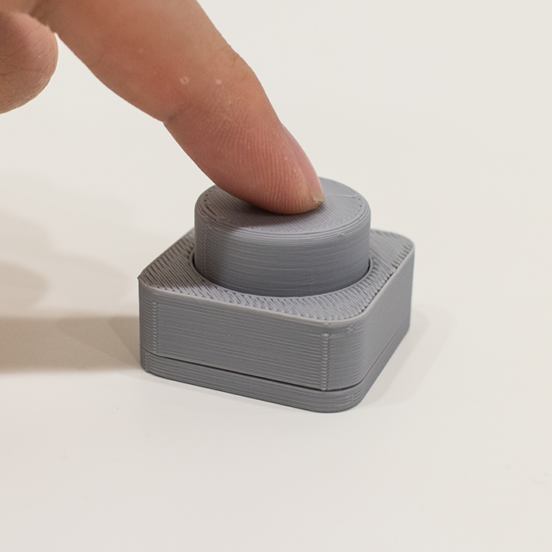
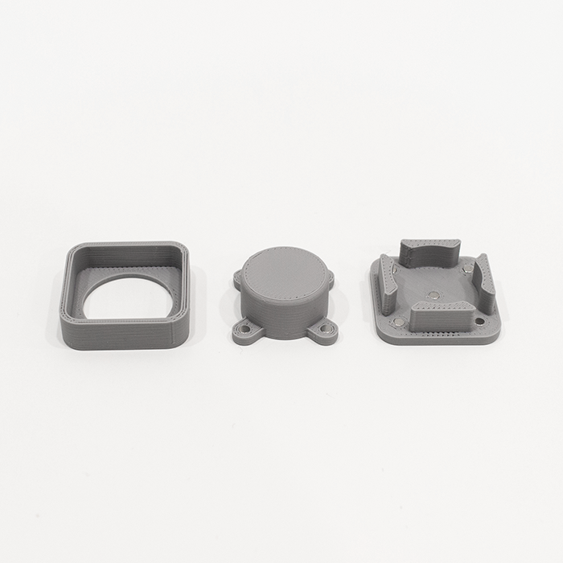
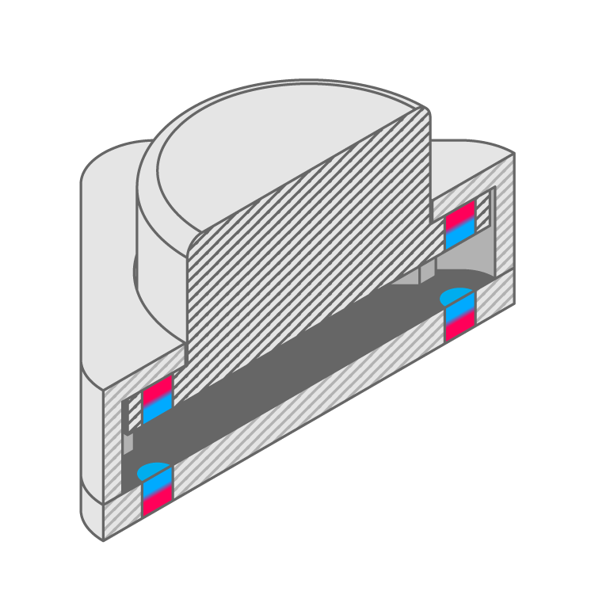

# Analog Push Button
 

## 3D Model

[**Download 3D Model Type A**](https://a360.co/2IVTaXW)

 

## Images

| Assembled | Disassembled | Cross Section |
| --- | --- | --- |
|  |  |  |

 

## Bill of Materials

| Part Name | Quantity | Sample Source |
| --- | :---: | --- |
| Button (3D print) | 1 | [Download from repo](Print_AnalogButton_Button.stl) |
| Case Top (3D print) | 1 | [Download from repo](Print_AnalogButton_CaseA.stl) |
| Case Base (3D print) | 1 | [Download from repo](Print_AnalogButton_CaseB.stl) |
| 1/8 x 1/8 Inch Neodymium Rare Earth Cylinder Magnets | 8 | [Total Element](https://totalelement.com/collections/cylinder-magnets/products/1-8-x-1-8-inch-neodymium-rare-earth-cylinder-magnets-n48-100-pack) |

 

## 3D printing
* All STL files were printed with a [Cetus 3D Printer](https://www.cetus3d.com/).
* Filament used: [Polymaker Polylite PLA](http://www.polymaker.com/shop/polylitetrade/)
* Printer settings:
  * Layer height: **0.25mm**
  * Infill: **15%**
  * Quality: **Normal**
  * Raft but no supports

**Note:** the disassembled image illustrates the part orientation for 3D printing (i.e. which face contacts the bed).