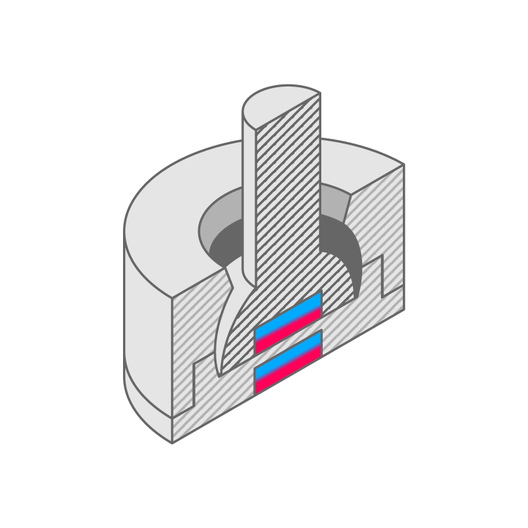

# Existing Mechanism Swatches

These different swatches attempt to replicate the look, feel and function of existing input mechanisms. They are currently customizable as [Fusion 360](https://www.autodesk.com/products/fusion-360/students-teachers-educators) parametric models. Each folder contains the STL files for 3D printing and its corresponding bill of materials and settings.
   

## Swatch List

| Links (Model/Repo) | Assembled | Disassembled | Cross Section |
| --- | --- | --- | --- |
| [**Momentary&nbsp;Push&nbsp;Button**](Momentary%20Push%20Button) [Model Type A](http://a360.co/2ETcFkX) |  |  |  |
| [**Analog Push Button**](Analog%20Push%20Button) [Model Type A](https://a360.co/2IVTaXW) |  |  |  |
| [**Toggle Switch**](Toggle%20Switch) [Model Type A](http://a360.co/2FnV1pF) |  |  |  |
| [**Side Toggle**](Side%20Toggle) [Model Type A](https://a360.co/2IUgt4k) |  |  |  |
| [**Joystick**](Joystick) [Model Type A](https://a360.co/2IVoINM) |  |  |  |
| [**Thumbstick**](Thumbstick) [Model Type A](https://a360.co/2unZAfm) |  |  |  |
| [**Stepped Rotary Input**](Stepped%20Rotary%20Input) [Model Type A](http://a360.co/2H2wfbK) |  |  |  |
| [**Stepped Slider**](Stepped%20Slider) [Model Type A](http://a360.co/2Fnwxgg) |  |  |  | 

  

## 3D printing
* All STL files were printed with a [Cetus 3D Printer](https://www.cetus3d.com/).
* Filament used: [Polymaker Polylite PLA](http://www.polymaker.com/shop/polylitetrade/)
* Printer settings:
  * Layer height: **0.25mm**
  * Infill: **15%**
  * Quality: **Normal**
  * Raft but no supports

  

## Editing in Fusion 360

1. Download the 3D model as a `Fusion 360 archive` to edit it in Fusion 360.
2. Make sure you are in `Model` mode.
3. Customize the model by changing its parameters.
    - Select `Modify`, then `Change Parameters`. 
    - The model's parameters are located in the `Parameters` sketch.