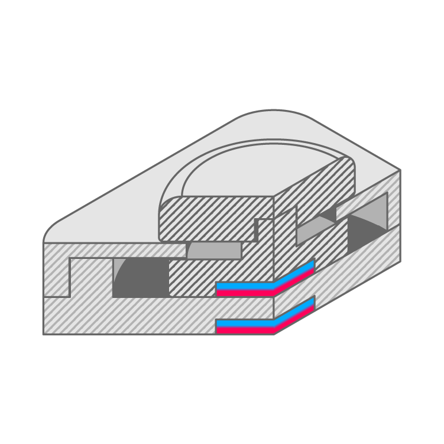

# Existing Mechanism Swatches

These different swatches attempt to replicate the look, feel and function of existing input mechanisms. They are currently customizable as [Fusion 360](https://www.autodesk.com/products/fusion-360/students-teachers-educators) parametric models. Each folder contains the STL files for 3D printing and its corresponding bill of materials and settings.
   

## Swatch List

| Type | Assembled | Disassembled | Cross Section |
| --- | --- | --- | --- |
| Momentary Push Button |  |  |  |
| Analog Push Button |  |  |  |
| Toggle Switch |  |  |  |
| Side Toggle |  |  |  |
| Joystick |  |  |  |
| Thumbstick |  |  |  |
| Stepped Rotary Input |  |  |  |
| Stepped Slider |  |  |  | 

  

## Editing in Fusion 360

