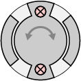

# Mechamagnets Taxonomy

This taxonomy maps the basic physical input models afforded by Mechamagnets. It was developed by crossing 5 spatial constraints optimized for FDM printing, with 6 haptic profiles via static magnets.
   

## Spatial Constraints

Mass-produced physical inputs typically employ injection molding and automated assembly lines. Their designs rely on a high degree of manufacturing tolerance that is unattainable with FDM. As such, rather than mimic the construction of commercial components, we developed Mechamagnets by deconstructing existing physical inputs into simpler models.

| linear | angular | polar | planar | radial |
| --- | --- | --- | --- | --- |
||||||

   

## Haptic Mechanisms

Commercial inputs rely on an assembly of different components to deliver haptic feedback and mechanical behavior. For instance, a mechanical keyboard button uses contact leaves to generate a “click” when it is pressed (haptic feedback), and a spring to push it back to its original position (mechanical behavior). In Mechamagnets, we investigated using only static magnets and 3D printing to specify different unpowered haptic feedback as well as mechanical behaviors of inputs.

   

## Taxonomy

| | attracting center | repelling center | attracting steps | repelling steps | attracting end | repelling end |
| --- | --- | --- | --- | --- | --- | --- |
| **Linear** |  [STL Files](Linear/Linear_Attracting-Center) [Fusion 360](https://a360.co/2qmrZ0z) |  [STL Files](Linear/Linear_Repelling-Center) [Fusion 360](https://a360.co/2CTjDoC) |  [STL Files](Linear/Linear_Attracting-Steps) [Fusion 360](https://a360.co/2QciaNM) |  [STL Files](Linear/Linear_Repelling-Steps) [Fusion 360](https://a360.co/2CTtLh6) |  [STL Files](Linear/Linear_Attracting-End) [Fusion 360](https://a360.co/2P4Ywqs) |  [STL Files](Linear/Linear_Repelling-End) [Fusion 360](https://a360.co/2qoJdKs) |
| **angular** |  [STL Files](Angular/Angular_Attracting-Center) [Fusion 360](https://a360.co/2qpvH9G) |  [STL Files](Angular/Angular_Repelling-Center) [Fusion 360](https://a360.co/2CUSt0w) |  [STL Files](Angular/Angular_Attracting-Steps) [Fusion 360](https://a360.co/2P2tEaq) |  [STL Files](Angular/Angular_Repelling-Steps) [Fusion 360](https://a360.co/2qoea1K) |  [STL Files](Angular/Angular_Attracting-End) [Fusion 360](https://a360.co/2CVcvb6) |  [STL Files](Angular/Angular_Repelling-End) [Fusion 360](https://a360.co/2CYElDk) |
| **polar** |  [STL Files](Polar/Polar_Attracting-Center) [Fusion 360](https://a360.co/2CVeT1y) |  [STL Files](Polar/Polar_Repelling-Center) [Fusion 360](https://a360.co/2qvsPIx) |  [STL Files](Polar/Polar_Attracting-Steps) [Fusion 360](https://a360.co/2CRoc2N) |  [STL Files](Polar/Polar_Repelling-Steps) [Fusion 360](https://a360.co/2qqlvxr) |  [STL Files](Polar/Polar_Attracting-End) [Fusion 360](https://a360.co/2CUTGF6) |  [STL Files](Polar/Polar_Repelling-End) [Fusion 360](https://a360.co/2qo1E1X) |
| **planar** |  [STL Files](Planar/Planar_Attracting-Center) [Fusion 360](https://a360.co/2Qax5rS) |  [STL Files](Planar/Planar_Repelling-Center) [Fusion 360](https://a360.co/2CVDOlG) |  [STL Files](Planar/Planar_Attracting-Steps) [Fusion 360](https://a360.co/2CST0A9) |  [STL Files](Planar/Planar_Repelling-Steps) [Fusion 360](https://a360.co/2qlUNGm) |  [STL Files](Planar/Planar_Attracting-End) [Fusion 360](https://a360.co/2CTwSFO) | |
| **radial** |   [STL Files](Radial/Radial_Attracting-Center) [Fusion 360](https://a360.co/2CWUr0f) | |   [STL Files](Radial/Radial_Attracting-Steps) [Fusion 360](https://a360.co/2CT3n6S) | | | |

